## PYTEST

[](https://travis-ci.org/alexiej/travis-github-sample)


https://docs.pytest.org/en/latest/

**Unittest** - jest to standardowa biblioteka do testowania. Do jej testowania wymagana jest odpowiednia klasa `unittest.TestCase`

```python
# example from: http://www.rohitschauhan.com/index.php/2018/07/05/python-relative-benefits-of-pytest-unittest-nose-and-doctest/
import unittest

class TestMethods(unittest.TestCase):
    def test_mult_integers(self):
        """ Tests mult() method for two integers """
        self.assertEqual(2*3, 6)
        
if __name__ == "__main__":
    unittest.main()       
```

 Natomiast `pytest` pozwala napisać testy o wiele prościej 

```python
def test_mult_integers():
    """ Tests sample_method() for two integers """
    assert 2*3 == 6
```

### Instalacja

`pip install -U pytest`

`pip --version`

### Prawidłowa struktura katalogów

Aby nie dostawać błędów, warto na samym początku posiadać prawidłową strukturę plików i katalogów. W przykładzie jest stosowane że istnieje katalog projektu `kalkulator` oraz katalog testów `tests`, i w każdym znajduje się plik `__init__.py` oznaczający że jest osobną paczką.

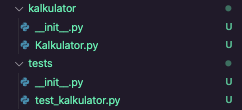

Jeśli będzie brakować jakiś plików, albo struktura będzie inna wtedy `pytest` może zwrócić błąd `ModuleNotFoundError`


`Kalkulator.py`

```python
class Kalkulator:

    def dodaj(self,a: int,b: int) -> int:
        return a + b
```

`test_kalulator.py`

```python
from kalkulator.Kalkulator import Kalkulator


def test_dodaj():
    k = Kalkulator()
    assert k.dodaj(2,3) == 5
```

### Wymagania:

* Wszystkie testy znajdują się w jednym katalogu `tests` 
*  każdy moduł testu powinny posiadać jakiś przedrostek albo suffix, np: `test_ `
*  Nazwa klasy testu nie musi nic zawierać, ani przydrostku, ale musi dziedziczyć po klasie `unittest.TestCase`
* Nazwa metody wewnątrz klasy musi zawierać przedrostek `test_`
* Plik testu nie może zawierać błędów, inaczej nie zostanie wykryty.
* musi być uruchamiany z katalogu głównego katalogu projektu

https://docs.pytest.org/en/latest/goodpractices.html

https://gist.github.com/tasdikrahman/2bdb3fb31136a3768fac - PYTON TEST STRUCTURE

### Testowanie

`pytest --collect-only`  - Wylistowuje wszystkie testy


`python -m pytest`

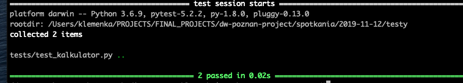

W przypadku zmiany `kalkulator.py`:

```python
class Kalkulator:

    def dodaj(self,a: int,b: int) -> int:
        return a + b + 1
```


### Używając klasy

```python
import unittest
class test_kalulator_class(unittest.TestCase):
    def __init__(self, *args, **kwargs):
        super(test_kalulator_class, self).__init__(*args,**kwargs)
        self.kaklulator = Kalkulator()

    def test_dodaj(self ):
        self.assertEqual( self.kaklulator.dodaj(2,3)  , 5)
```

### Mock

Mock służy do udawania i zwracania obiektów tak jakbyśmy chcieli. Pomaga to przy tym gdy chcemy testować coś czego konfiguracja może zająć dużo czasu, albo długo się uruchamiają.

```python
import unittest.mock
	def test_dodaj_mock(self):
        k = Kalkulator()
        k.dodaj = MagicMock(return_value=5)
        self.assertEqual(k.dodaj(2,3), 5)
        self.assertEqual(k.dodaj(5,7), 5)
```

Używając `patch`

```python
    @patch.object(Kalkulator, attribute='dodaj', return_value=5)
    def test_mock1(self, patch_object):
        k = Kalkulator()
        self.assertEqual(k.dodaj(5,4), 5)
```

## Testy w VSCode

Wymagane rozszerzenie `Python`


2. W Command Palette należy skonfigurować jakie testy chcemy używać


* Ustawiamy na `pytest`


* Ustawiamy na katalog `tests`

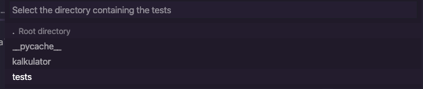

* Odświeżamy katalog tests

  ****

* Uruchamiamy testy dla naszego modułu


## Uruchamianie testów w PyCharm

https://www.jetbrains.com/help/pycharm/testing-your-first-python-application.html

Jeśli się przestrzega zasad nazewnictwa, test powinień być dostępny w Pycharmie jako znak ▶(zielony).

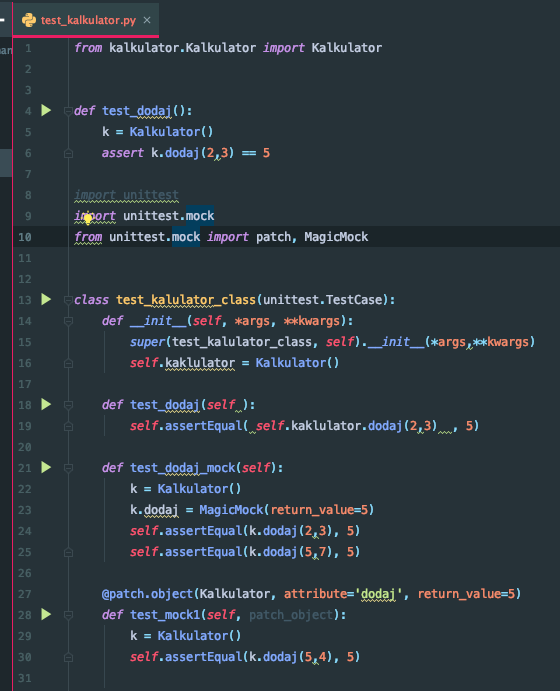


### Dodawanie konfiguracji

1. Wchodzimy do `Edit Configuration`

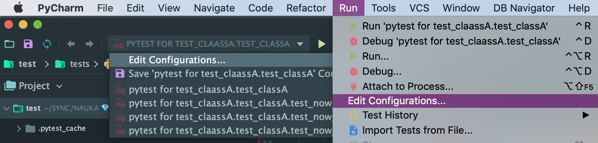

2. Dodajemy nowy test (pytest)


3. Ustawiamy Target: `Script path`, ustawiamy go na folder testu `tests`


4. Od teraz możemy go uruchamiać.

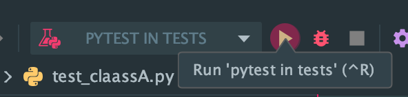

### Włączanie autotestu

Po włączeniu `PyCharm` automatycznie wykryje nasze zmiany i uruchomi testy za każdym razem.

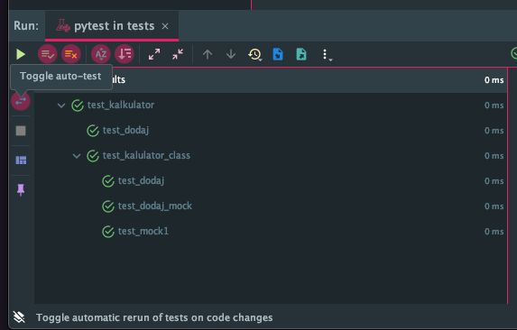

## Continuous Integration/ Continuous delivery / Continuous deployment

https://www.atlassian.com/continuous-delivery/principles/continuous-integration-vs-delivery-vs-deployment

* Continuous Integration - Strategia która pozwala sprawdzać czy nasz kod jest zgodny z testami i możemy nasz kod zaakceptować i z integrować z podstawowym kodem, tak że inne osoby mogą z niego korzystać jeśli przejdą testy. 
* Continuous Delivery - Pozwala na automatyczną integrację kodu gdy testą przejdą pomyślnie.
* Continuous Deployment - Proces który pozwala wysłać nasz kod i zbudować nasz wynikowy kod na produkcję i przesłać do klientów. 

## CI with GitHub and Travis

https://github.com/alexiej/travis-github-sample

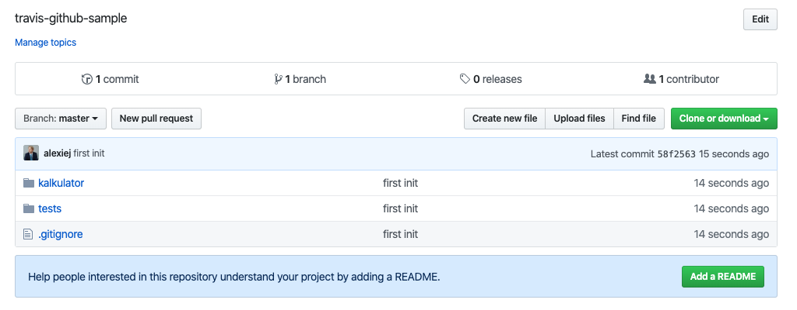

Jak zintegrować ustawienia z Travis?

1. W Travis wchodzimy w ustawienia i szukamy naszego repozytorium. 


2. Włączamy nasze repozytorium


3. Na stronie GitHub powinien pojawić się Webhooks do naszego projektu.

Pozwala on na informowanie Travis-a na wszystkie zmiany w naszym kodzie na GitHub.


4. Następnie tworzymy nasz plik `.travis.yml` . yml - Są to pliku typu `yaml` (JSON który zamiast klamer używa biały znaków). Jest to konfiguracja naszego projektu.

```yaml
language: python
python:
  - "3.6"
install:
  - pip install -r requriements.txt
script:
  - pytest
```

Po wysłaniu projektu, powinien się pojawić że wszystko 


5. Możesz także dodać status swojego projektu do pliku README.md

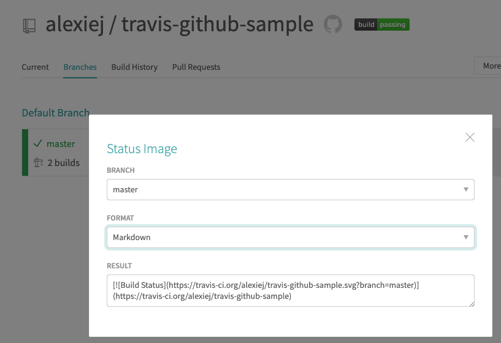

```python
# README

[](https://travis-ci.org/alexiej/travis-github-sample)
```

#### Automatyczny deploy

1. Do automatycznego `Deploy` wymagany jest GITHUB Token który trzeba utworzyć


2. W Developer Settings klikamy **Generate new Token**.

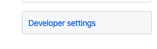

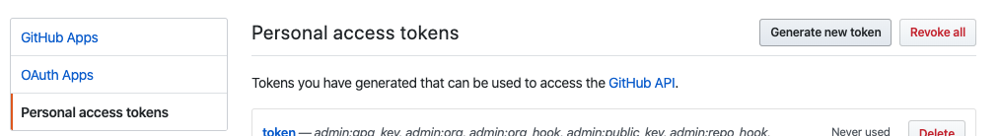

3. Ustawiamy że ma mieć dostęp do publicznego REPO, i klikamy **GENERATE**

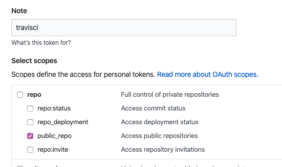

4. Kopiujemy nasz Token

   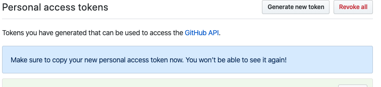

5. Na stronie `Travis` w naszym repozytorium dodajemy konfigurację do naszego repo.

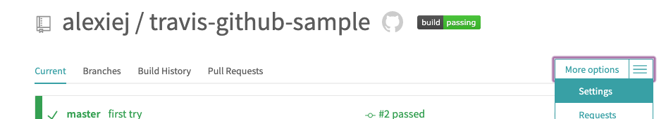


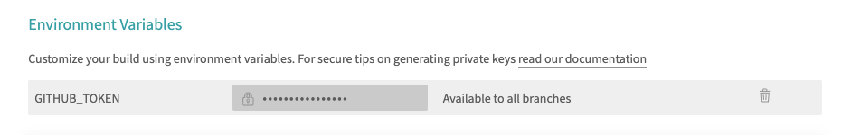

6. Zmieniamy ustawienia tak żeby za każdym szczęśliwym zakończeniem robił `deploy` na branch `master`. 

```yaml
language: python
python:
  - "3.6"
before_install:
install:
  - pip install -r requirements.txt
script:
  - pytest
deploy:
  provider: pages
  skip_cleanup: true
  github_token: $GITHUB_TOKEN  # Set in the settings page of your repository, as a secure variable
  keep_history: true
  on:
    branch: master
```

6. Teraz za każdym razem gdy wysyłam kod na serwer Github, Travis tworzy nowy branch.

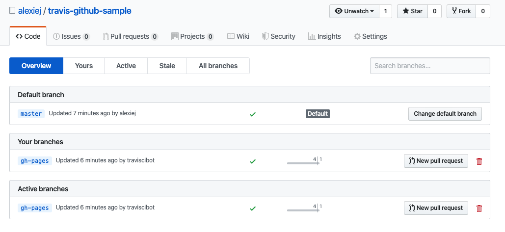

### Branches

1. `git pull`

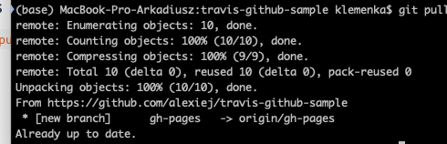

2. `git branch aktualizacja_dodaj` - Tworzmy nowy branch gdzie będziemy testować nasze zmiany

2. ` git checkout aktualizacja_dodaj` - Zmieniamy nasz branch na aktualny
3. Tworzymy zmiany

4. Dodajemy zmiany i wysyłamy na serwer.

```python
git add .
git commit -m "aktualizacja dodaj"
git pull origin aktualizacja_dodaj
```

5. Pojawia się nowy branch

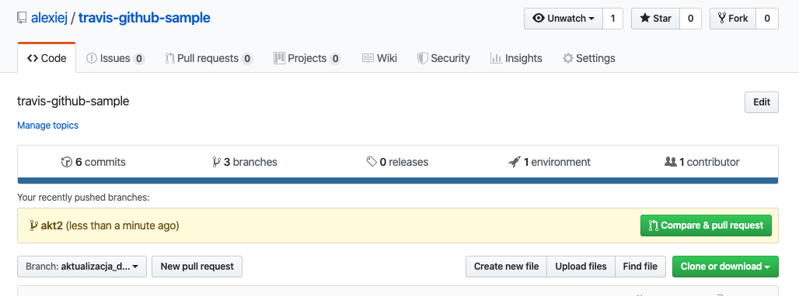

6. Możesz teraz zrobić pull-request.

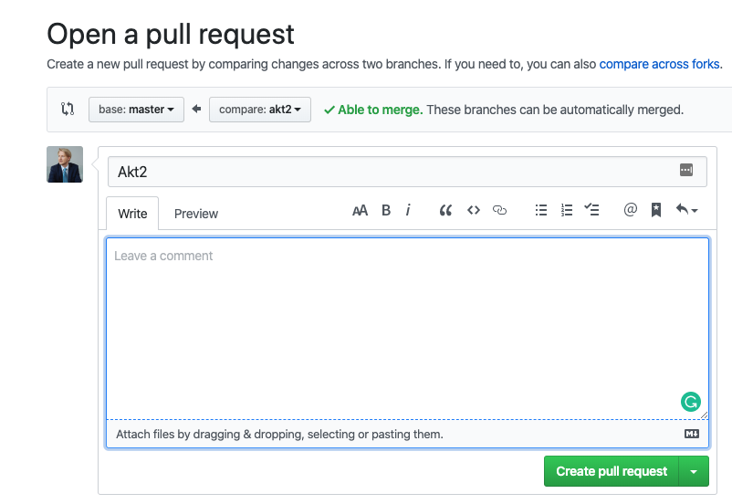

7. Travis automatycznie sprawdzi ten branch.

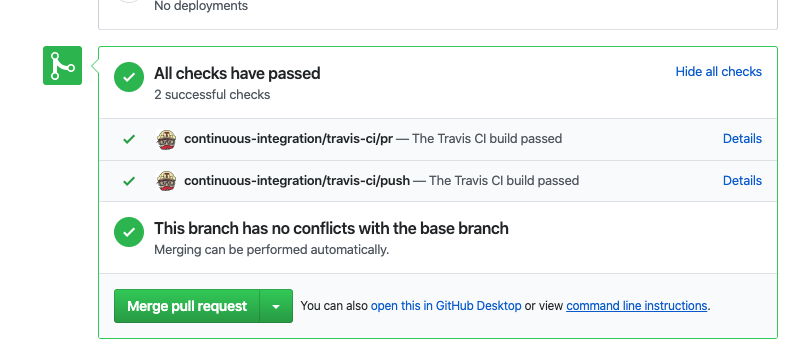

8. Jeśli wszystko przebiegnie prawidłowo można ten branch dołączyć do naszego `master`.

