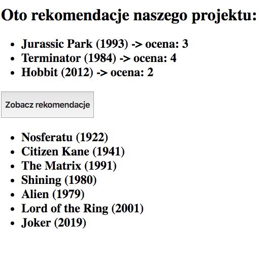

## Opis

Spotkaliśmys się 06-go lutego 2020 w clockwork Poznań. Agenda projektu

* 01. Pokaz projektu
* 02. Motywacja
* 03. Historia projektu
* 04. Struktura projektu
* 05. Wyzwania
* 06. Kodowanie produktu
* 07. Zakończenie i pytania
  

Prezentacja ze spotkania jest dostępna w pliku: [DW Poznań - projekt filmweb-rekomendacje #6](https://github.com/dataworkshop/dw-poznan-project/raw/master/spotkania/2020-02-06/DW%20Pozna%C5%84%20-%20projekt%20filmweb-rekomendacje%20%236.pdf)

## Notatka

Dzisiaj było już podsumowanie naszego projektu http://filmy-rekomendacje.pl/# w którym pokazaliśmy przez nasz gotowy projekt. Podczas prezentacji zaprezentowaliśmy nasze moytwacje i co nas skłoniło do udziału w tym projekcie. Historia projektu od listopada zeszłego roku do dzisiaj. Prezentowaliśmy także trudności które napotkaliśmy, a na koniec zaprezentowaliśmy już cały kod jak przy pomocy Flask-a, Vue.js i surprise stworzyć własny serwer to rekomendacji.

Dziękuje Mateuszowi, Pawłowi oraz Krzysztofowi za przygotowanie prezentacji :)  Nasz serwer dostępny jest pod adresem:

http://filmy-rekomendacje.pl/#

* Cały kod dostępny jest na w katalogu GitHub, a nagranie będzie dostępne niedługo.

https://github.com/dataworkshop/dw-poznan-project/tree/master/spotkania/2020-02-06

Chętnych proszę o przesłanie formy jak podobała się prezentacja: https://forms.gle/LDKuSTJeqnzSQLbe9

A my widzimy się już w środę w lużnej atmosferze na piwie:  w **napwiek Pub**, w **środę  (12-go lutego 2020) o 18:30**, Poznań ul. Wodna 12 lokal D.

https://napiwekpub.pl/

