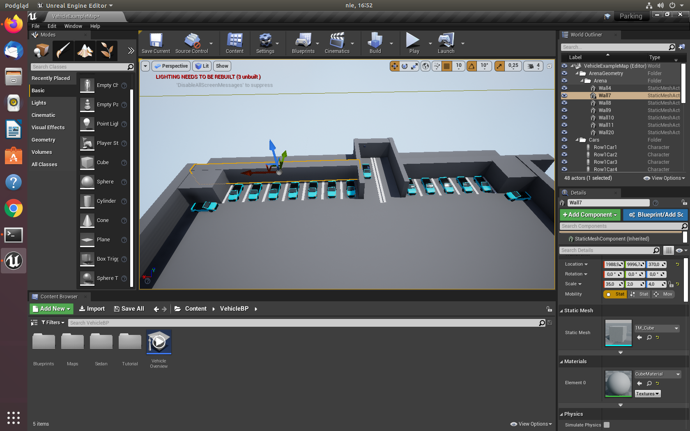

## Podsumowanie spotkania - DW POZNAN #13 Projekt #2

Dzięki wszystkim za spotkanie.  Tym razem prześledziliśmy różne symulatory komputerowe dzięki którym 

* Poznaliśmy po co tworzy się symulatory
* Przyjrzeliśmy się symulatorom Udacity i TORC
* Przyjrzeliśmy się symulatorom opartymi na `Unreal engine` **AirSim** oraz **CARLA**
* Przyjrzeliśmy się jak proogramować symulator CARLA do własnych celów

## VIDEO

[](https://youtu.be/Hh4UfDU6Gpk?list=PLa8KbhSQZVUhFsfa2Por7p10Oo8LKoBmD)

### PREZENTACCJA

[DWPOZNAN13.pdf](https://github.com/dataworkshop/dw-poznan-project/blob/master/spotkania/2020-07-23/DWPOZNAN_13.pdf)

#### Co następnym razem?

Dzięki Krzystofowi holubowicz tworzymy już symulator i zaczniemy tworzyć pierwsze obrazki do wykrywania obiektów raz symulacji jazdy. 




#### Uruchomienie

Przykładowo proojekt do `AirSim` wymaga najpierw zainstalowalania pakietu `airsim` oraz uruchomioonego symulatora.

```
pip install airsim
```

Uruchamiamy przez:

```
python hell_car.py
```

źródło:

```python
import airsim
import cv2
import numpy as np
import os
import setup_path 
import time

# connect to the AirSim simulator 
client = airsim.CarClient()
client.confirmConnection()
client.enableApiControl(True)
car_controls = airsim.CarControls()

for idx in range(3):
    # get state of the car
    car_state = client.getCarState()
    print("Speed %d, Gear %d" % (car_state.speed, car_state.gear))

    # go forward
    car_controls.throttle = 0.5
    car_controls.steering = 0
    client.setCarControls(car_controls)
    print("Go Forward")
    time.sleep(3)   # let car drive a bit

    # Go forward + steer right
    car_controls.throttle = 0.5
    car_controls.steering = 1
    client.setCarControls(car_controls)
    print("Go Forward, steer right")
    time.sleep(3)   # let car drive a bit

    # go reverse
    car_controls.throttle = -0.5
    car_controls.is_manual_gear = True;
    car_controls.manual_gear = -1
    car_controls.steering = 0
    client.setCarControls(car_controls)
    print("Go reverse, steer right")
    time.sleep(3)   # let car drive a bit
    car_controls.is_manual_gear = False; # change back gear to auto
    car_controls.manual_gear = 0  

    # apply brakes
    car_controls.brake = 1
    client.setCarControls(car_controls)
    print("Apply brakes")
    time.sleep(3)   # let car drive a bit
    car_controls.brake = 0 #remove brake
    
    # get camera images from the car
    responses = client.simGetImages([
        airsim.ImageRequest("0", airsim.ImageType.DepthVis),  #depth visualization image
        airsim.ImageRequest("1", airsim.ImageType.DepthPerspective, True), #depth in perspective projection
        airsim.ImageRequest("1", airsim.ImageType.Scene), #scene vision image in png format
        airsim.ImageRequest("1", airsim.ImageType.Scene, False, False)])  #scene vision image in uncompressed RGB array
    print('Retrieved images: %d', len(responses))

    for response in responses:
        filename = 'c:/temp/py' + str(idx)
        if not os.path.exists('c:/temp/'):
            os.makedirs('c:/temp/')
        if response.pixels_as_float:
            print("Type %d, size %d" % (response.image_type, len(response.image_data_float)))
            airsim.write_pfm(os.path.normpath(filename + '.pfm'), airsim.get_pfm_array(response))
        elif response.compress: #png format
            print("Type %d, size %d" % (response.image_type, len(response.image_data_uint8)))
            airsim.write_file(os.path.normpath(filename + '.png'), response.image_data_uint8)
        else: #uncompressed array
            print("Type %d, size %d" % (response.image_type, len(response.image_data_uint8)))
            img1d = np.fromstring(response.image_data_uint8, dtype=np.uint8) # get numpy array
            img_rgb = img1d.reshape(response.height, response.width, 3) # reshape array to 3 channel image array H X W X 3
            cv2.imwrite(os.path.normpath(filename + '.png'), img_rgb) # write to png 

#restore to original state
client.reset()

client.enableApiControl(False)
```

