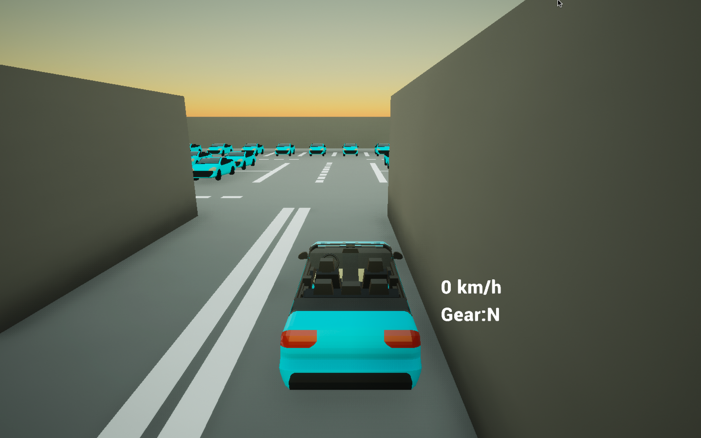

## Podsumowanie spotkania - DW POZNAN #14 Projekt #3

Dziękuje wszystkim uczestnikiom spotkania za poświęcony czas. Tym razem:

* mieliśmy okazję zobaczyć symulatory do pojazdów które możemy użyć do uczenia samochodu autonomicznego - od Udacity, TORCS po AirSim i CARLA, dzięki nim nasz autonomiczny pojazd będzie mógł się nauczyć jak prawidłowo się poruszać po mapie.  Cała prezentacja znajduje się pod linkiem:
  
* Pokazaliśmy naszą pierwszą wersje symulatora dzięki Krzysztof Holubowicz, i został on udostępniony na stronie projektu. Aplikacje pod Windows/MacOS można ściągnąć z linka podanego poniżej, a źródło znajduje się na stronie projektu.

https://github.com/DataWorkshop-Foundation/poznan-project02-car-model/releases/tag/0.1alpha

## Video

**Strona projektu:**

https://github.com/DataWorkshop-Foundation/poznan-project02-car-model/

