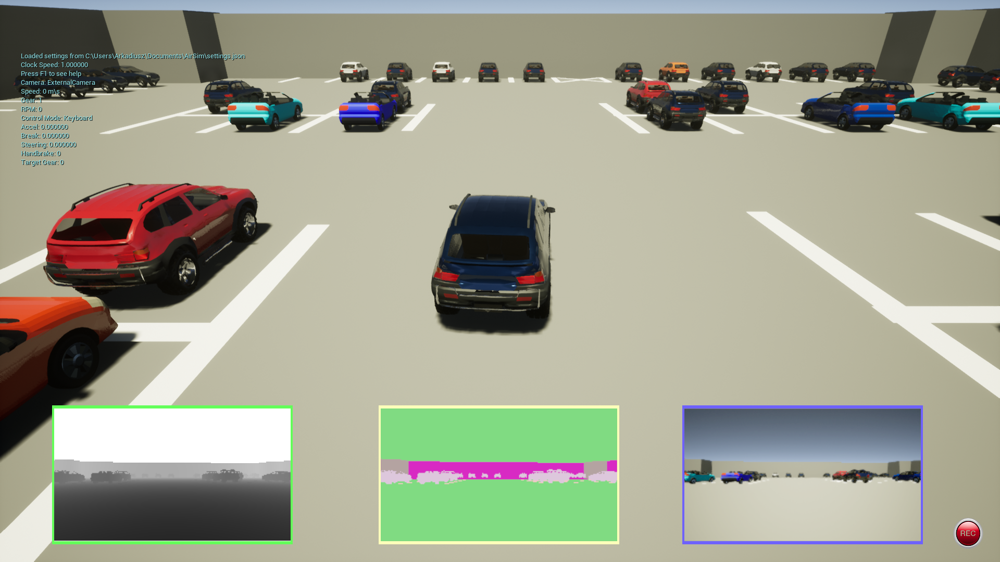

## Podsumowanie spotkania - DW POZNAN #15

Dziękuje wszystkim uczestnikiom spotkania za poświęcony czas. Tym razem:

* Pokazaliśmy nasz pierwszy model UNET do uczenia rozpoznawania obrazów i można go zobaczyć na stronie Kaggle.

  https://www.kaggle.com/klemenko/pozna-dataworkshop-car-project-dataset

* Pokazaliśmy nową wersję naszego symulatora w której możemy już nagrywać nasze przejażdzki.

https://github.com/DataWorkshop-Foundation/poznan-project02-car-model/releases/tag/02alpha

## Video

## Strona projektu

https://github.com/DataWorkshop-Foundation/poznan-project02-car-model/

## Następne Kroki

* Przestawimy nasz model w symulatorze, oraz zobaczymy inne modele rozpoznawania obrazów

Jeszcze raz dziękuje za zaanagażowanie i wyczekuje kolejnego spotkania :) 